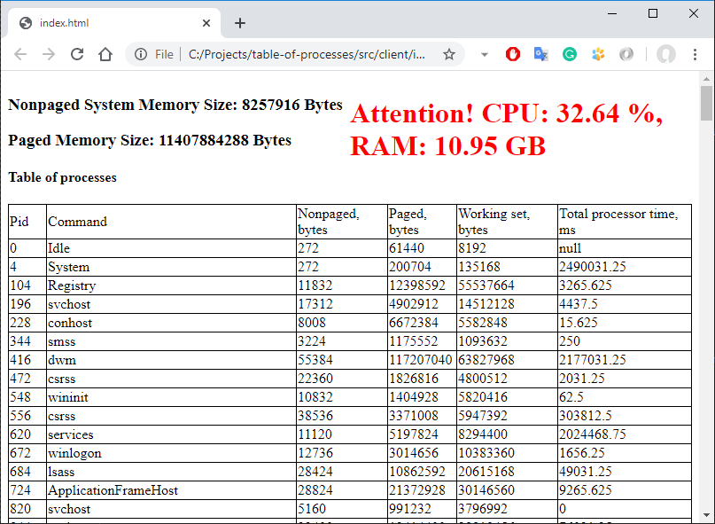

# Problem statement

Design, document and implement a system that monitors currently running processes (like 'top' utility on *nix). Add simple user interface that shows gathered information. Design the system to support multiple clients created with various technologies. Document APIs that other developers could use to create additional user interfaces to the system.

Try to minimize a number of external libraries and dependencies you use in this project - imagine that you have to do this task on computer with clean Visual Studio installation without internet access. The goal is to demonstrate your ability to write code and address problems.

Bonus part: Implement notifications about high load (CPU, Memory, etc.) to all connected clients. 


# System documentation

Client: HTML + JavaScript.

Server: WebApplication with REST API (.NET Core 3.1).

## How to run?
1) Build in Visual Studio.
2) Start with IIS Express profile.
3) Open http://localhost:50253/api/tableofprocesses/statistics to see results from server.
4) Open ```src\client\index.html``` to see how client is working.

